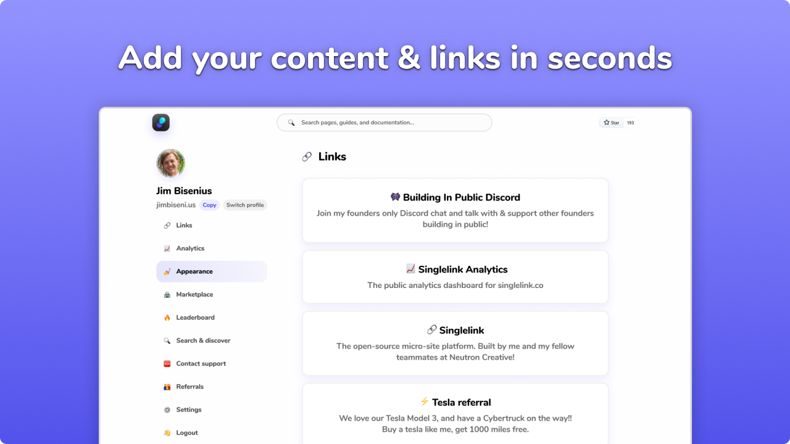
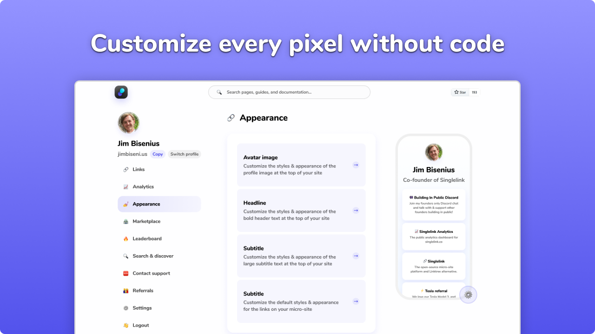

<br><h1 align="center"><a target="_blank" href="https://singlelink.co">Singlelink</a>, the open-source Linktree alternative</h1>
<p align="center">
    <a href="https://github.com/Neutron-Creative/Singlelink/projects/1">
        
    </a>
    <a href="https://www.gnu.org/licenses/gpl-3.0.en.html">
        
    </a>
    <a href="https://app.singlelink.co/analytics"/>
        
    </a>
	<a href="https://twitter.com/singlelink">
		
	</a
	<a href="https://discord.gg/BUbmgV4">
		
	</a>
</p>


<div align="center">

<h4>Try out <a href="https://singlelink.co" target="_blank">Singlelink</a> for free in seconds 👇</h4>

<a title="Deploy to DigitalOcean" href="https://cloud.digitalocean.com/apps/new?repo=https://github.com/Neutron-Creative/Singlelink/tree/master" target="_blank"></a>
<a title="Deploy to Heroku" href="https://app.singlelink.co/create-account" target="_blank"></a>
<a title="Deploy to Singlelink Cloud" href="https://app.singlelink.co/create-account" target="_blank"></a>

</div>

<br><br>

## Getting started
To install <a target="_blank" href="https://singlelink.co">Singlelink</a> locally, follow our steps below or watch one of our available <a href="https://youtube.com/" target="_blank">video installation guides! 👉</a>

### Pre-requisites
To install <a target="_blank" href="https://singlelink.co">Singlelink</a>, please ensure you have the following installed.

- <a href="https://www.postgresql.org/" target="_blank">PostgreSQL</a>
- <a href="https://nodejs.org/en/" target="_blank">NPM/Node.JS</a>
- <a href="https://www.docker.com/" target="_blank">Docker</a> (optional)

Optionally, you can also provide API credentials for the following providers to enable additional features.

- <a href="https://mixpanel.com" target="_blank">Mixpanel</a> (Event tracking)
- <a href="https://www.simplefileupload.com/" target="_blank">SimpleFileUpload</a> (Avatar upload/file storage)
- <a href="https://capture.neutron.so" target="_blank">Neutron Capture</a> (Profile OG image screenshots)

### Setup with NPM
1. Clone the repository
```bash
git clone https://github.com/Neutron-Creative/Singlelink.git
```
2. Install the dependencies with NPM
```bash
cd client;npm install;cd ../server;npm install;cd ../;
```
3. Run the setup script
```bash
npm run setup
```
4. Build & launch <a target="_blank" href="https://singlelink.co">Singlelink</a>
```bash
npm run build;npm run start;
```

### Development setup
The development setup is similar to the vanilla NPM setup, however comes with <a href="https://vue-loader.vuejs.org/guide/hot-reload.html" target="_blank">hot-reloading</a> enabled.<br>**🚨 This should not be used in production 🚨**
1. Clone the repository
```bash
git clone https://github.com/Neutron-Creative/Singlelink.git
```
2. Install the dependencies with NPM
```bash
cd client;npm install;cd ../server;npm install;cd ../;
```
3. Run the setup script
```bash
npm run setup
```
4. Launch <a target="_blank" href="https://singlelink.co">Singlelink</a> with hot-reloading enabled
```bash
npm run dev
```

## Screenshots




## Roadmap
See our <a href="https://github.com/Neutron-Creative/Singlelink/issues" target="_blank">open issues</a> to see what we're building next, alongside a list of known bugs and suggestions. <br>Don't see what you're looking for? <a href="https://github.com/Neutron-Creative/Singlelink/issues/new" target="_blank">Submit an issue!</a>

## Support
Need help? Our <a href="https://discord.com/invite/3pBM4Px" target="_blank">community support </a> is online 9AM-5PM EST M-F, and our <a href="mailto:support@neutroncreative.com">enterprise support team</a> is available 24/7/365 via (<a href="mailto:support@neutroncreative.com">email</a> or <a href="tel:+19196530790">phone</a>). Please don't hesitate to get in touch, we love to help and we're often able to resolve issues within the hour!

## Contributing
Being open-source, we welcome and encourage all contributions to our project.

To make your first contribution, follow these steps:

1. Fork the project
2. Create your new feature's branch
3. Make your changes
4. Commit your changes & push
5. Open a pull request

**Bonus:** Make your first contribution to get added to the readme, and after three successful merges we'll send you a t-shirt! 🎉<br>*Promotion only valid while supplies last. <a href="https://discord.gg/BUbmgV4" target="_blank">Send us a message on Discord</a> to confirm availability!*

## License
Proudly distributed under the GNU GPL v3 License. See `LICENSE` for more information.

## Acknowledgements
Special thanks to everyone who helps make <a target="_blank" href="https://singlelink.co">Singlelink</a> great!
### Our partners & sponsors
- <a href="https://www.browserstack.com/" target="_blank">BrowserStack</a> (cross-broswer UI/UX testing, sponsor)
- <a href="https://digitalocean.com/" target="_blank">DigitalOcean</a> (cloud hosting for developers, partner)

### Our team members
<a href="https://twitter.com/jim_bisenius" title="Jim Bisenius, Co-founder & President of Singlelink" target="_blank"></a>
<a href="https://twitter.com/navidk0" title="Navid Kabir, Co-founder & CTO of Singlelink" target="_blank"></a>
<a href="https://twitter.com/drewbits" title="Drew Boyle, Co-founder & CMO of Singlelink" target="_blank"></a>

<br><br>
---------------
<h3 align="center"><a href="https://singlelink.co" target="_blank">Singlelink</a>, the open-source Linktree alternative</h3>
<h4 align="center">
    Create your free micro-site in seconds at <a href="https://app.singlelink.co/create-account" target="_blank">singlelink.co 👉</a>
</h4>