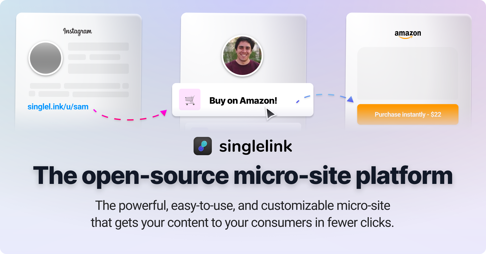

<h1 align="center">
    <br>
    <br>
    <a href="https://singlelink.co"></a>
    <br>
    <br>
</h1>

<h3 align="center">
    <a href="https://singlelink.co">Singlelink</a> is the open-source micro-site platform & Linktree alternative.
</h3>

<br>

<p align="center">
    <a href="https://github.com/Neutron-Creative/Singlelink/projects/1">
        
    </a>
    <a href="https://www.gnu.org/licenses/gpl-3.0.en.html">
        
    </a>
    <a href="https://app.singlelink.co/analytics"/>
        
    </a>
    <a href="https://neutroncreative.com">
        
    </a>
</p>

<p align="center">
	<a href="https://twitter.com/neutroncreative">
		
	</a
	<a href="https://discord.gg/BUbmgV4">
		
	</a>
</p>

<p align="center">
  <a href="#get-started">Get started</a> •
  <a href="#development">Development</a> •
  <a href="#deployment">Deployment</a> •
  <a href="#credits">Credits</a> •
  <a href="#support">Support</a> •
  <a href="#related">Related</a> •
  <a href="#license">License</a>
</p>
<br>

<!---->


<br>

<h2 id="get-started">Get started</h2>

<p>There are a few pre-requisites you need to have before hosting <a href="https://singlelink.co">Singlelink</a>, seen below.</p>

<ul>
    <li>Two NodeJS servers (ex: $5/mo DigitalOcean Droplet)</li>
    <li>A PostgreSQL database (ex: Free Heroku DBaaS)</li>
</ul>

<p>Once you have the following established, it's time to begin installing & configuring your installation.</p>

<h3>Client</h3>

```Bash
# Clone repostiory to local device
git clone https://github.com/Neutron-Creative/Singlelink.git

# Enter client of new project
cd Singlelink/client

# Install necessary dependencies
npm install

# Set API Url
export API_URL=<your-api-url>

# Optionally, customize your instance.
# You can also set these permanently via the .env file
export META_TITLE=<your-seo-meta-title>
export META_DESCRIPTION=<your-seo-meta-description>
export META_IMAGE=<your-meta-image>
export FAVICON=<your-favicon-url>
export HOSTNAME=<your-installation-hostname>
export APP_NAME=<your-app-name>
export ICON_URL=<your-icon-url>
export ICON_WIDTH=<your-icon-width>
export ORGANIZATION=<your-organization>
export FREE_SIGNUP=<is-freesignup-enabled>

# Run first build
npm run build

# Start your server
npm run start

```

<h3>Server</h3>

```Bash
# Clone repostiory to local device (don't need to repeat if performed previously for client)
git clone https://github.com/Neutron-Creative/Singlelink.git

# Enter client of new project
cd Singlelink/server

# Install necessary dependencies
npm install

# Generate config from example
cp src/config.example.js src/config.js

# Modify config.js (set API domain to localhost & client domain as neccessary)
vim config.js

# Build server
npm run build

# Start your server
npm run start
```

<br>

<h2 id="development">Development</h2>
<h3>Client</h3>
<p>Develop on the client if you're looking to make changes to the interface or styles of the application.<br>Note, pay attention to the notice below. You'll need to build & start the client before each usage to have your changes reflect properly in the application.</p>

```Bash
## CD into Client
cd Singlelink/client

# Run developer client
npm run dev

```

<h4>Server</h4>
<p>Develop on the server if you're looking to make changes to the logic of the application.<br>Developing on the server is a bit simpler, in that there is no "rebuild" process. With nodemon, changes are reloaded live instantaneously.</p>

```Bash
## CD into Server
cd Singlelink/server

# Run developer server
npm run dev
```

<br>

<h2 id="deployment">Deployment</h2>
<p>Use the following instructions for deploying changes made locally to your production servers.<br>Note, before following the next steps - ensure you have pushed all changes to the git master branch!</p>
<h3>Client</h3>

```Bash

# SSH into server
ssh root@<your-server-ip>

# Enter tmux session (if first time then tmux && cd Singlelink)
tmux attach

# Pull latest changes from git, install dependencies, rebuild, and restart the server
git pull;npm i;npm run build;npm run start;

# Exit tmux session
# Not to be typed, press both keys simultaneously
# Ctrl + b
# Afterwhich, press the following key
# d

# Exit server, changes are deployed!


```

<h3>Server</h3>

``` Bash

# SSH into server
ssh root@<your-server-ip>

# Enter correct directory
cd ~/Singlelink/server/

# Pull latest changes from git, install dependencies, rebuild, and restart the server
git pull;npm i;npm run build;npm run start;

# Exit server, changes are deployed!

```

<br>
<h2 id="credits">Credits</h2>
Singlelink was built by the following individuals.<br><br>
<ul>
    <li>Jim Bisenius (<a target="_blank" href="https://twitter.com/jim_bisenius">@jim_bisenius</a>)</li>
    <li>Andrew Boyle (<a target="_blank" href="https://twitter.com/fahlomi">@fahlomi</a>)</li>
    <li>Navid Kabir (<a target="_blank" href="https://twitter.com/navidk0">@navidk0</a>)</li>
    <li>Manuhe Abebe (<a target="_blank" href="https://twitter.com/manuhegabebe">@manuhegabebe</a>)</li>
</ul>
Currently, Singlelink lacks contributors outside its founders at Neutron Creative, but, you can help.
Visit the <a target="_blank" href="https://github.com/Neutron-Creative/Singlelink/issues">issues page</a> today and create your first pull request to get featured here!

<br><br>
<h2 id="support">Support</h2>
Need help? Our <a href="https://discord.com/invite/3pBM4Px" target="_blank">community support </a> is online 9AM-5PM EST M-F, and our <a href="mailto:support@neutroncreative.com">enterprise support team</a> is available 24/7/365 via (<a href="mailto:support@neutroncreative.com">email</a> or <a href="tel:+19196530790">phone</a>). Don't hesitate to get in touch, we love to help and we're often able to resolve issues within the hour!
<br><br>
Additionally, we've listed a few frequently asked questions below.

##### Help, my API isn't working!

Often, this is caused by an incomplete config.js file in Singlelink/server/config.js, be sure this is complete!

##### My client isn't working properly!

This is most often caused by an incomplete/incorrect build, with missing environment variables or something of the like. To fix, ensure that the $API_URL environment variable is properly set on your client server, and run npm run build inside your client directory to manually rebuild the project.

##### How can I host this on Netlify?

Unfortunately, we discontinued static platform support in late 2020 when moving to v2.0 to gain features such as dynamic open-graph images, search engine optimization, alongside custom meta data.

##### When will you have *x* feature?

Check our <a href="https://github.com/Neutron-Creative/Singlelink/projects">roadmap</a>! We're regularly adding new features, and list our most up-to-date plans on Github.

##### I'm having trouble installing Singlelink. Can I pay you to install & it for me?

Yes! As of January 2020, you can reach out to support@neutroncreative.com and we'll be glad to help you get set up (incurs $100 install + $35/mo hosting fees). We offer full installation, management, and maintenance services for Enterprise clients starting at just $35/mo.

##### How can I suggest a feature/report a bug?

The <a href="https://github.com/Neutron-Creative/Singlelink/issues" target="_blank">Github issue tracker</a> is the best place to do that! No matter your experience & ability creating Github issues, this is the best way for us to see & respond quickly to your requests.

##### Do you have a community I can join?

Yes! We're actively daily on <a href="https://discord.com/invite/3pBM4Px" target="_blank">Discord</a> and would love to have you!


<br><br>

